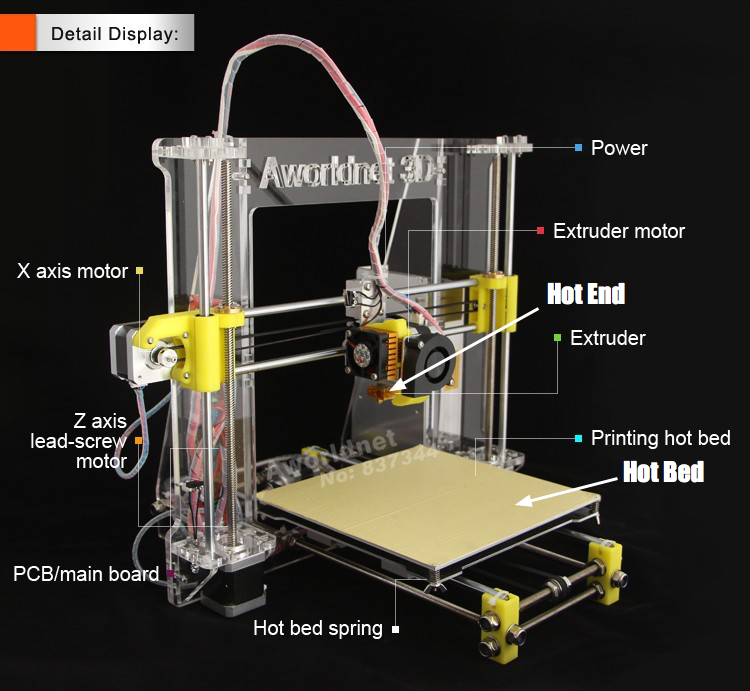

# 3D 프린터

## 하드웨어

### 메인보드(구)

[Melzi Reprap 1.1](http://reprap.org/wiki/Melzi)  

전원부분이 조금 타버리고 압출기의 모터가 wobble거리는 문제가 있었다.  
그래서 RAMP 1.4 + Arduino Mega 2560 메인보드로 교체하려고 했으나,  
갑자기 정상작동해서 교체하지는 않았다.

#### 컴퓨터가 Melzi 메인보드를 인식하지 못할 때
프린터가 연결된 컴퓨터를 바꾸면 Melzi 메인보드를 인식하지 못할 수 있다.  
Mac이나 Linux는 자동으로 드라이버를 인식하는 경우가 많은데, Windows는 드라이버를 수동으로 설치해주어야 한다.  
이 때는 다음 링크를 통해서 드라이버를 다운받는다. [FTDI driver 다운받기](http://www.ftdichip.com/Drivers/VCP.htm)  
드라이버를 설치하는 방법은 다음 링크를 참고한다. [FTDI driver 설치하기](http://forums.reprap.org/read.php?1,417199,418768#msg-418768)

### 메인보드(신)

### 압출기(Extruder)
압출기는 다양한 종류가 있다.

> 아래 핫엔드(hotend)와 헷갈리지 않도록 하자
> 

#### Greg's Wade's Extruder

그냥 이런게 있다는 것만 알아도 충분하다.

#### Direct Drive Extruder

동아리 3D 프린터에서 사용 중인 압출기와 같은 종류이다. 여기에 필라멘트가 핫엔드로 들어가는 도중에 녹지 않도록 쿨링 팬(cooling fan)을 달았다.

### 스텝 모터

#### 개요
모터는 크게 다음 두 가지로 나눌 수 있다.

- DC(Direct Current)모터
- 스텝모터

DC모터는 일정 크기 이상의 전압을 인가하면 작동하는 것에 그치는 반면, 스텝모터는 전기적 신호를 스텝 횟수로 계산하여 정말하게 움직인다. 따라서 정밀한 절삭 공구나 로봇을 만들 때는 스텝모터를 활용하기도 한다.

같은 이유로 3D 프린터는 스텝 모터를 사용한다. 구체적으로는 4 Lead Bipolar Step Motor를 사용하고 있다.

#### 각도 표시

| 용도             | 모터 종류       |
| :--------------- | :-------------- |
| X축, Y축, 압출기 | 1.8도 스텝 모터 |
| Z축              | 2.7도 스텝 모터 |

> #### 스템 모터의 각도는 어떤 의미를 갖는가?
> 스텝 모터의 각도는 한 번 신호가 들어올 때 얼마나 움직일 것인가를 결정하는 지표이다. 한 번에 움직이는 정도를 '스텝(step)'이라고 부른다.
>
> 1.8도 스텝 모터의 경우, `360 / 1.8 = 200`의 식이 성립한다. 즉 모터가 한 바퀴 회전하기 위해서 총 200 스텝이 필요하다.

#### 스텝 모터 드라이버 (Pololu A4988)

스텝 모터를 편하게 다루기 위해서 사용하는 작은 회로기판이다. 핀이 제대로 연결된 상태에서 전원을 켜도록 한다. 필자는 스텝 모터 드라이버를 상하 거꾸로 연결한 상테에서 전원을 켜는 바람에 스텝 모터 드라이버을 망가트린 전적이 있다.

#### 구조 및 배선

그 구조와 배선 색깔은 다음과 같다:

  
(Color Code 1 참조)

하지만 동아리 3D 프린터의 RAMPS 1.4 보드를 보면 조금 다르게 쓰여있다는 것을 확인할 수 있을 것이다.

위 그림에서와 같이 RAMPS 1.4 보드에는 2B, 2A, 1A, 1B 핀을 스텝모터에 연결하라고 표시되어 있는 것을 볼 수 있다. 표기 방법이 다르지만 비슷해서 조금 헷갈릴 것이다. 하지만 이미 위 그림에는 스텝모터를 어떻게 연결해야 하는지 힌트가 주어져 있다.

스텝모터 다이어그램(가)을 살펴보면 4개의 선이 (A, A')와 (B, B')로 두 개씩 묶여서 표현되어 있다. 반면 Pololu A4988 스텝모터 드라이버 회로도(나)에서는 (1A, 1B)와 (2A, 2B)로 표현되었다. 두 방식 모두 알파벳 대문자 A, B를 사용해서 다소 헷갈리지만 완전히 반대로 사용되고 있다는 것을 알아야 한다. 스텝모터 배선이 잘못되면 스텝모터가 돌아가지 않고 진동만 하므로 주의해서 납땜을 해야 한다.

두 표현 방식의 대응 관계를 표로 정리하면 다음과 같다.

| 색깔 | (가) | (나) |
| :--: | :--: | :--: |
| 빨강 |  A   |  1A  |
| 파랑 |  A'  |  1B  |
| 초록 |  B   |  2A  |
| 검정 |  B'  |  2B  |

## Software

### 드라이버

#### Windows용 드라이버 설치
1. 위에서 다운로드 받은 FTDI 드라이버의 압축을 푼다.
2. 장치관리자를 열어서 `FT232R USB UART`을 찾는다.
3. 마우스 오른쪽 버튼을 클릭해서 `속성 > 드라이버 > 드라이버 업데이트`를 선택
4. 압축을 푼 FTDI 드라이버의 위치를 찾아준다.

### 개요

사용하게될 소프트웨어는 크게 세 가지로 구분할 수 있다.  

 - 호스트(Host)  

   컴퓨터와 3D 프린터를 연결해주는 소프트웨어이다.  
   3D 프린터의 X, Y, Z축의 움직임과 압출기 그리고 Hotend와 Heated Bed의 온도를 제어할 수 있다.  
   ex) Repetier Host, Printrun

 - 슬라이서(Slicer)  

   로드한 STL 파일을 각 층(layer)별로 잘라서 압출기가 움직이는 경로를 정해준다.  
   ex) Cura, Sli3r

 - CAD  

   모델링 프로그램이다. FreeCAD도 괜찮고 123D Design을 사용하는 것도 좋다.  
   ex) FreeCAD, AutoCAD, 123D Design, Blender

우리는 Repetier Host와 Sli3r을 사용한다.

### Repetier Host

Repetier Host 안에서 Slicer를 실행시킬 수 있으므로 간편하게 Repetier Host만 사용하도록 하자.  
각 소프트웨어에 대한 자세한 설명은 ~~추가바람~~

## 문제 해결
