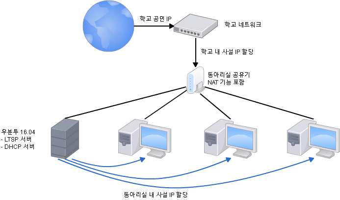

# LTSP 서버 이해하기

## LTSP 소개

학교 컴퓨터실에는 40 ~ 50대의 컴퓨터를 유지 및 관리한다. 만약 교육과정이 바뀌어서 모든 컴퓨터에 새로운 소프트웨어를 설치해야하는 상황이 발생한다면 컴퓨터 선생님은 선생님을 그만두고 싶은 충동이 들기 시작할 것이다. 이와 같이 다수의 컴퓨터를 개별적으로 관리하는 것은 상당히 고통스러운 일이다.

LTSP(Linux Terminal Service Project)는 이런 문제를 해결해줄 수 있다. LTSP 서버에서 필요한 소프트웨어를 **한 번만** 설치하면 모든 클라이언트에서 사용할 수 있다. 뿐만 아니라 클라이언트는 서버로부터 동일한 부팅 디스크 이미지를 전달받기 때문에 사용자들은 동일한 작업 환경을 경험할 수 있다.

LTSP 컴퓨팅 환경을 구축하면서 한 가지가 궁금했다. "왜 대한민국 학교들이 이러한 획기적인 기술을 활용하지 못하는가?" 일차적으로 학교들이 리눅스를 사용하지 않기 때문일 것이다. 대신에 Microsoft의 윈도우를 설치해서 사용하고 있다. 하지만 윈도우는 상업용 소프트웨어이고, 서버용이 아닌 개인 컴퓨터용 운영체제 환경에서 Terminal Service를 제공할 서버를 구축하기는 다소 한계가 있다.

## LTSP 서버 구현 계획



위 그림에 대한 이해를 돕기 위해서는 공유기가 어떤 기능을 하고 있는지 이야기할
필요가 있을 것 같다. 일반적으로 공유기는 영어로 라우터(Router)로 번역되는데,
엄밀한 의미에서 공유기는 순수한 라우터보다 더 많은 기능을 제공한다. 라우터의
순수한 기능은 외부 네트워크와 내부 내트워크를 연결해주는 것이다. 즉 인터넷이라는
추상적인 거대한 네트워크와 가정 및 회사에서 유지하고 있는 내부 내트워크를
연결해주는 장치라는 것이다.

하지만 우리 모두가 알고 있듯이 공유기는 단순히 외부 네트워크와 내부 네크워크를
연결해주는 기능에 그치지 않는다. 사실 우리가 공유기를 사용하는 목적은 SKT, KT,
LG U+ 등의 통신사들로부터 할당받은 한 개의 IP를 여러 장치가 공유하기 위한 것이다.

### 공유기

따라서 공유기는 추가적으로 다음 두 가지 기능을 제공해야 한다:

1. DHCP (Dynamic Host Configuration Protocol)
    - 내부 네트워크 안에서 각 클라이언트에게 사설 IP를 할당

2. NAT (Network Address Translation)
    - 각 클라이언트에 할당된 내부 사설 IP를 외부 공인 IP로 변환

하지만 LTSP 서버를 구축한 네트워크 안에서 공유기는 DHCP 기능을 담당하지는 않을 것이다. 대신에 LTSP 서버가 이 기능을 담당하여 연결된 클라이언트들에게 IP를 할당할 것이다.

언급한 두 가지 기능에 대해서 더 자세히 알고 싶으면 아래 두 영상이 도움이 될 것 같다.

<iframe width="560" height="315" src="https://www.youtube.com/embed/RUZohsAxPxQ" frameborder="0" allowfullscreen></iframe>

<iframe width="560" height="315" src="https://www.youtube.com/embed/QBqPzHEDzvo" frameborder="0" allowfullscreen></iframe>

라우터에 대해서 더 자세히 알고 싶으면 다음 영상을 참고하면 좋을 것 같다.

<iframe width="560" height="315" src="https://www.youtube.com/embed/Ofjsh_E4HFY" frameborder="0" allowfullscreen></iframe>

## 서버 구축 과정

### 우분투 16.04 LTS Gnome 설치하기

우분투 16.04 LTS Gnome를 설치한다.

> Gnome Session 대신에 Unity Session을 포함한 버전은 실험해보지 않았다. 우분투 14.04 LTS Unity 버전으로 실험할 때는 클라이언트에서 GUI를 제대로 표시하지 못하는 문제가 발생했는데, 이 때문에 우분투 16.04 LTS로 실험하면서 Unity 대신에 Gnome을 사용하였다.

> Unity와 Gnome은 리눅스 시스템에서 사용하는 Graphic User Interface이다. 이를 Session이라고 부르기도 한다. 이것 밖에도 MATE, KDE, Xfce 등이 있다. 더 자세히 알고 싶으면 나무위키나 구글에 검색해보자.

[공식 우분투 Wiki](https://wiki.ubuntu.com/UbuntuGNOME/GetUbuntuGNOME/Korean)에서 우분투 16.04 LTS Gnome 디스크 이미지를 다운받아서 사용했다.

### 수동 IP 할당

수동 IP를 할당하는 방법은 크게 두 가지가 있다.

1. 라우터
    - 서버 네트워크 카드의 고유 번호인 MAC Address에 따라서 IP를 고정적으로 할당

2. 운영체제 안에서 고정 IP 할당

하지만 동아리실 안에서 돌아가는 공유기는 내부 IP를 할당하지 않기 때문에, 동아리 서버는 운영체제 안에서 고정 IP를 부여하는 방식을 택했다. 다만 동아리실 공유기는 스스로에게 고정 IP(192.168.10.1)를 할당함으로서, 클라이언트가 인터넷 연결시 라우터를 찾을 수 있도록 하였다.

서버에 할당한 네트워크 정보는 다음과 같다:

| 입력 항목      | 입력 정보      |
| :------------- | :------------- |
| Interface Name | enp2s4         |
| IP Address     | 192.168.10.2   |
| Netmask        | 255.255.255.0  |
| Broadcast      | 192.168.10.255 |
| Gateway        | 192.168.10.1   |
| DNS Server     | 192.168.10.1   |

#### 1. 네크워크 어댑터에 고정 IP 할당
LTSP 서버가 DHCP 기능을 시작할 때, 운영체제 전반 뿐만 아니라 네트워크 어댑터가 수동 IP를 할당 받을 수 있도록 한다. 다음 명령어를 입력하여 파일을 수정한다.

```
sudo gedit /etc/network/interfaces
```

다음 내용을 입력해준다.

```
auto enp2s4
iface enp2s4 inet static
    address 192.168.10.2
    netmask 255.255.255.0
    broadcast 192.168.10.255
    gateway 192.168.10.1
```

#### 2. 네트워크 어댑터가 고정 IP를 할당받아 사용한다는 것을 운영체제에게 알림
다음 명령어를 입력하여 수정하려는 파일을 연다.

```
sudo gedit /etc/NetworkManager/NetworkManager.conf
```

`managed=false`로 되어 있는 것을 `managed=true`로 수정한다.

### LTSP 서버 설치하기

가상머신에 리눅스를 처음 설치하고 나면 터미널을 열고 다음 명령을 입력한다:

```
sudo apt-get update && sudo apt-get upgrade
sudo apt-get install ltsp-server-standalone
```

### DHCP 설정하기

### 네트워크 부팅 이미지 만들기

### 클라이언트 준비하기

클라이언트는 크게 Thin 클라이언트와 Fat 클라이언트로 나눌 수 있다. Thin 클라이언트는 데이터 처리의 대부분을 서버에 위탁하는 반면, Fat 클라이언트는 데이터 처리를 스스로 처리한다. 따라서 Thin 클라이언트는 높은 하드웨어 사양을 요구하지 않는 한편, Fat 클라이언트는 일반 PC에 준하는 하드웨어 사양을 요구한다. (Fat 클라이언트는 자체 HDD가 아니라 서버로부터 운영체제를 가져온다는 점을 제외하고는 일반 PC와 다르지 않다.)

LTSP 클라이언트는 자체 HDD를 가지고 있지 않아도 된다. 하지만, 모든 HDD를 탈착시키는 작업이 다소 번거롭기 때문에 이는 생략하였다. 부팅시 F2를 누르면서 바이오스 설정창을 띄운 다음 네트워크 부팅을 최우선순위로 설정하였다.

## 참고문헌

[우분투 LTSP 서버 구축하기 (영어)](https://www.thefanclub.co.za/how-to/how-create-ubuntu-1104-x64-ltsp-server-32bit-thin-clients)
