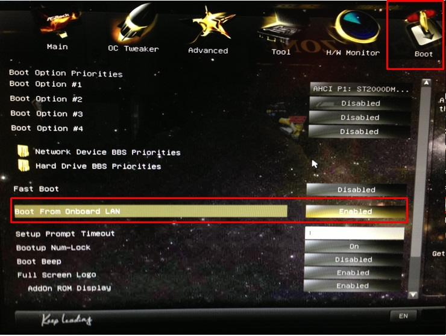

# 문제 해결

## 컴퓨터 부팅이 안됩니다.
> 세부증상: 키보드나 마우스에 전원이 들어오지 않는다.

메인 메모리가 메인보드에 잘 연결되어 있지 않으면 제대로 부팅이 되지 않을 수 있다. 스스로 컴퓨터를 분해하지 말고 집정관에게 문의해서 해결하도록 한다.

## 인터넷에 연결이 되지 않습니다.
> 세부증상: WeVo 라우터와 3Com 스위치 간의 연결을 끊으면 1 ~ 4번 컴퓨터에서는 정상적으로 인터넷에 연결된다.

WeVo 라우터에서 3Com 스위치로의 연결이 불량하면 인터넷 연결이 불안정하다. WeVo 라우터와 3Com 스위치 간의 LAN선 연결이 제대로 되어 있는지 혹시나 단선되어 있지 않은지 확인한다.

## 클라이언트에서 네트워크 부팅이 되지 않습니다.
바이오스(BIOS) 설정을 해주어야 한다. 컴퓨터마다 바이오스 설정 화면으로 들어가는 방법은 다르지만, 일반적으로 부팅할 때 F2를 눌러주면 바이오스 설정 화면으로 진입할 수 있다. 부팅(Booting) 탭에서 부팅 순서를 바꿔주면
2017년 학교에서 새로 받은 데스크탑을 기준으로 네트워크 부팅을 우선순위로 설정하는 방법을 설명하자면 다음과 같다:

1. 부팅시 F2를 눌러서 바이오스 설정 화면으로 진입한다.
2. 상단 Boot 버튼을 눌러서 부팅 설정 화면을 연다.
3. Boot From Onboard LAN이 enabled로 되어 있는지 확인한다.
    - disabled로 설정되어 있다면 이를 enabled로 바꾸고 저장한 다음 재부팅하여 다시 바이오스 설정 화면으로 들어간다.
    - enabled로 설정되어 있다면 재부팅하지 않고 바로 4번을 수행한다.
4. Boot Option #1에 `Realtek ...`이 들어가도록 설정한다.
5. 하드디스크에서 부팅하는 것을 막기위해서 `AHCI ...`이 적혀있는 Boot Option을 disabled로 바꾸어준다. (선택)

> 인터넷에서 검색해보니 새로 받은 데스크탑의 메인보드의 이름은 **ASRock H87**이다.

